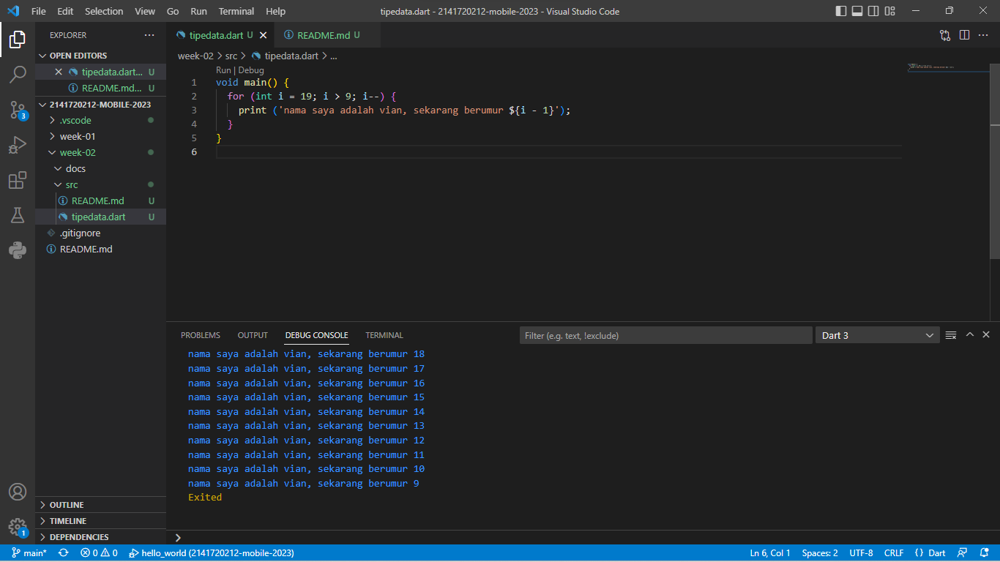

## Jenio Dwi Setyo Favian Gian
## 3F - 14

# Tugas Praktikum

# Soal 1

# Soal 2

Mengapa sangat penting untuk memahami bahasa pemrograman Dart sebelum kita menggunakan framework Flutter ? Jelaskan!

Jawab :

sebelum menggunakan framework Flutter sangat penting karena Dart adalah landasan utama dari Flutter. Dart adalah bahasa yang digunakan untuk menulis kode dalam Flutter, sehingga pemahaman yang kuat tentang bahasa ini akan memberikan landasan yang kokoh untuk membangun aplikasi Flutter yang sukses. Dengan pemahaman Dart, akan lebih mudah menguasai sintaks, struktur, dan fitur-fitur Dart yang diperlukan dalam pengembangan Flutter. Selain itu, pemahaman Dart juga membantu dalam mengatasi masalah, memecahkan bug, dan mengoptimalkan kinerja aplikasi. Ini juga penting dalam penggunaan paket dan library Dart yang sering digunakan dalam pengembangan Flutter. Jadi, pemahaman Dart adalah langkah awal untuk menjadi pengembang Flutter yang kompeten dan efisien.

# Soal 3

Rangkumlah materi dari codelab ini menjadi poin-poin penting yang dapat Anda gunakan untuk membantu proses pengembangan aplikasi mobile menggunakan framework Flutter.

Jawab :

- Mengetahui kelebihan serta fitur fitur dari bahasa pemrograman dart
 - Evolusi atau perkembangan dart dari tahun ke tahun
 - Mengidentifikasi bagaimana sistem dari bahasa pemrograman dart bekerja
 - Memahami struktur dari bahasa pemrograman dart
 - Mengetahui operator operator yang bis digunakan
 - Mencoba coding dengan bahasa dart

# Soal 4

Buatlah slide yang berisi penjelasan dan contoh eksekusi kode tentang perbedaan Null Safety dan Late variabel ! (Khusus soal ini kelompok berupa link google slide)

Jawab :

https://www.canva.com/design/DAFtkHKG9aI/kV_VKPXT9vQikmqTKdT1AQ/edit