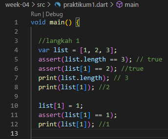
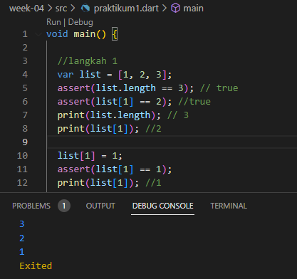
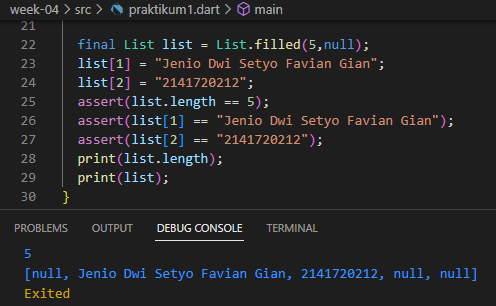
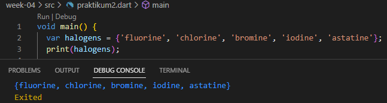
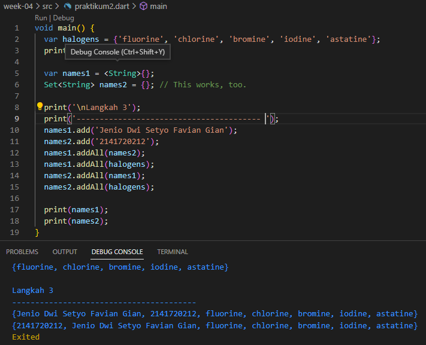

## Jenio Dwi Setyo Favian Gian
## 3F - 14

# Tugas Praktikum

# Praktikum 1: Eksperimen Tipe Data List

## Langkah 1:
Ketik atau salin kode program berikut ke dalam void main().

## Langkah 2:
Silakan coba eksekusi (Run) kode pada langkah 1 tersebut. Apa yang terjadi? Jelaskan!

## Langkah 3:
Ubah kode pada langkah 1 menjadi variabel final yang mempunyai index = 5 dengan default value = null. Isilah nama dan NIM Anda pada elemen index ke-1 dan ke-2. Lalu print dan capture hasilnya.
Apa yang terjadi ? Jika terjadi error, silakan perbaiki.

# Praktikum 2: Eksperimen Tipe Data Set

## Langkah 1:
Ketik atau salin kode program berikut ke dalam fungsi main().

## Langkah 2:
Silakan coba eksekusi (Run) kode pada langkah 1 tersebut. Apa yang terjadi? Jelaskan! Lalu perbaiki jika terjadi error.

## Langkah 3:
Tambahkan kode program berikut, lalu coba eksekusi (Run) kode Anda.
Apa yang terjadi ? Jika terjadi error, silakan perbaiki namun tetap menggunakan ketiga variabel tersebut. Tambahkan elemen nama dan NIM Anda pada kedua variabel Set tersebut dengan dua fungsi berbeda yaitu .add() dan .addAll(). Untuk variabel Map dihapus, nanti kita coba di praktikum selanjutnya.

# Praktikum 3: Eksperimen Tipe Data Maps
# Praktikum 4: Eksperimen Tipe Data List: Spread dan Control-flow Operators
# Praktikum 5: Eksperimen Tipe Data Records