# Jenio Dwi Setyo Favian Gian (2141720212) / 3F

---

# Praktikum 3: Menerapkan Widget Dasar

## Hasil di Emulator

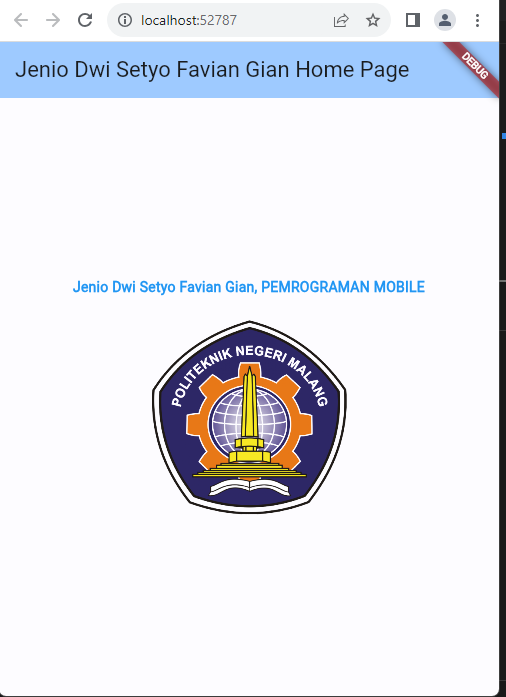

## Hasil di HP (SAMSUNG)

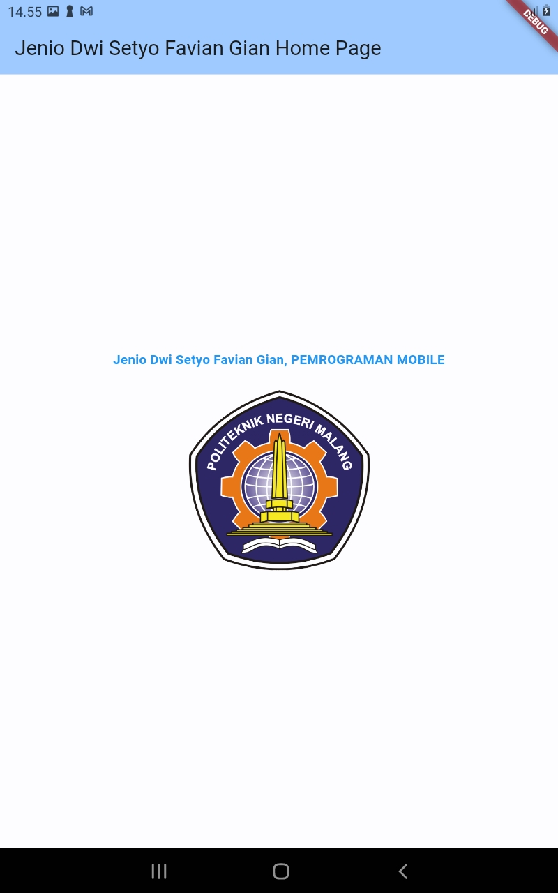

---

# Praktikum 4: Menerapkan Widget Material Design dan iOS Cupertino

## Langkah 1: Cupertino Button dan Loading Bar

## Hasil di Emulator

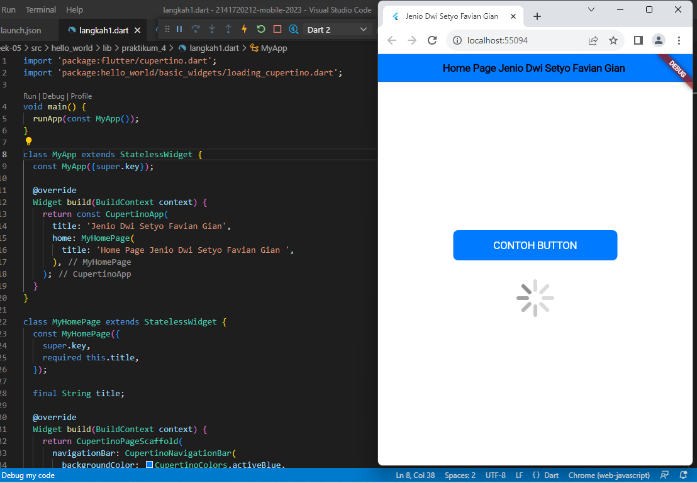

## Hasil di HP (SAMSUNG)

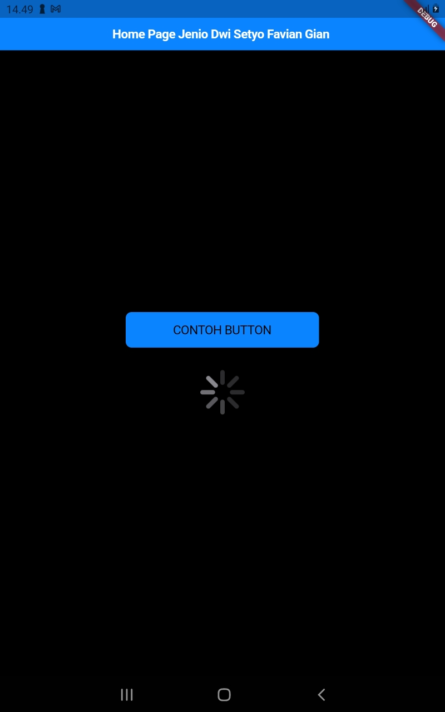

## Langkah 2: Floating Action Button (FAB)

## Hasil di Emulator

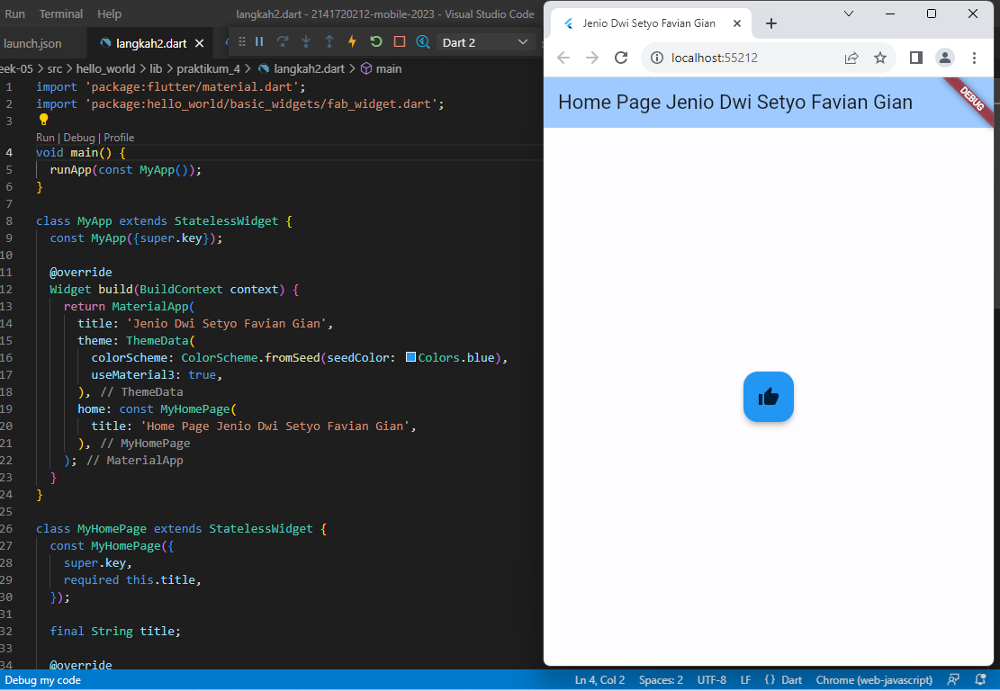

## Hasil di HP (SAMSUNG)

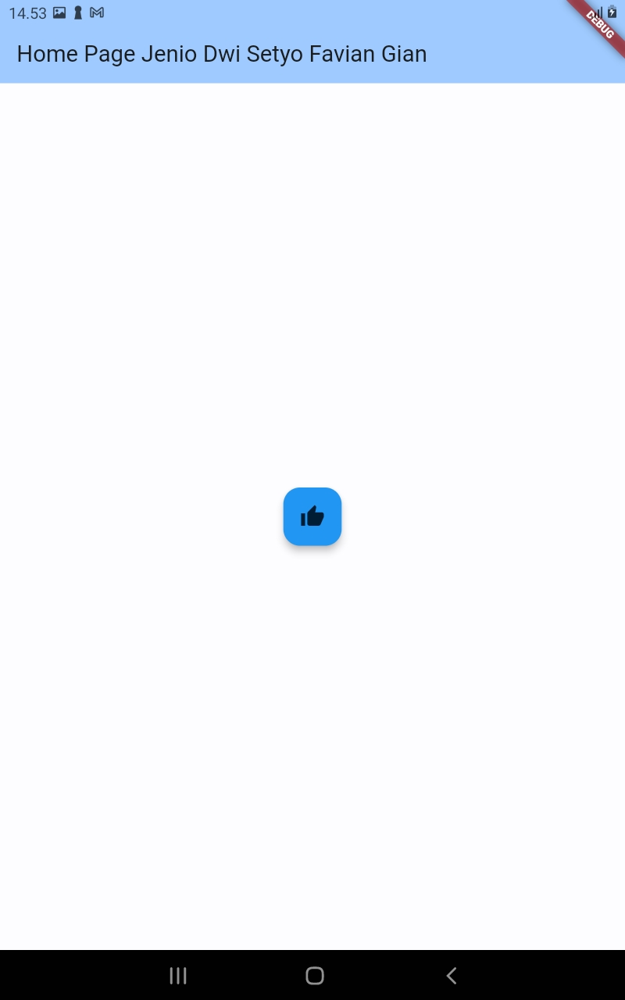

## Langkah 3: Scaffold Widget

## Hasil di Emulator

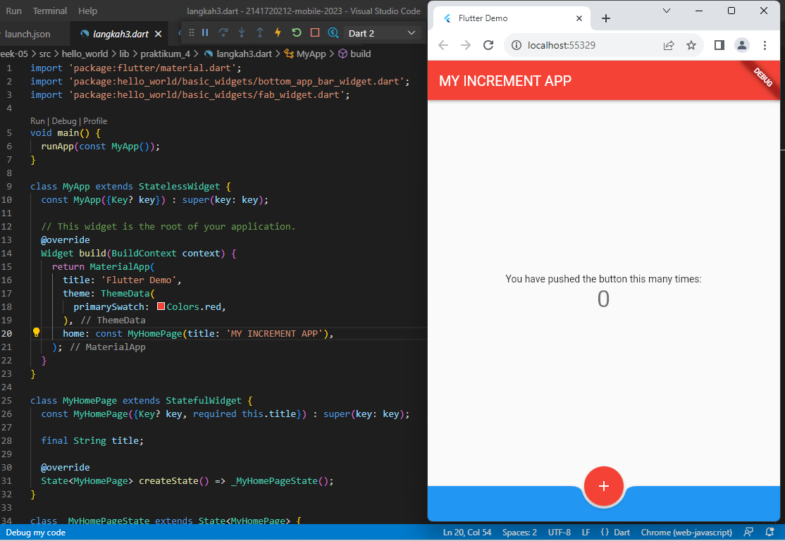

## Hasil di HP (SAMSUNG)

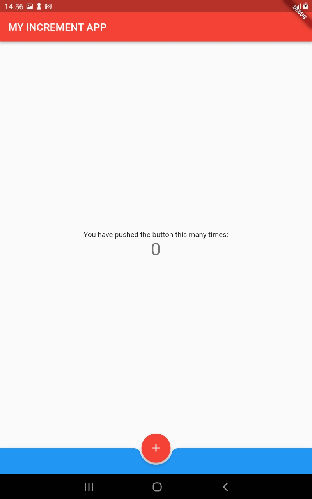

## Langkah 4: Dialog Widget

## Hasil di Emulator

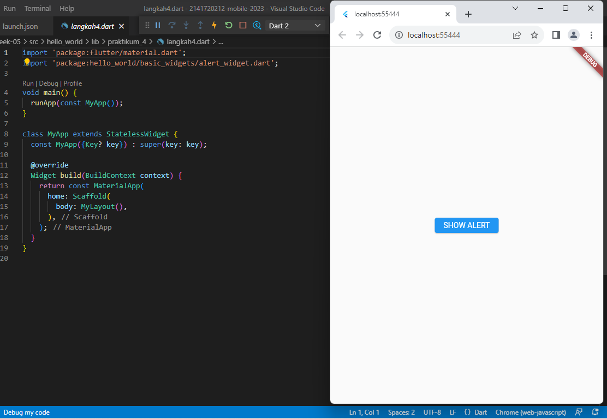

## Hasil di HP (SAMSUNG)

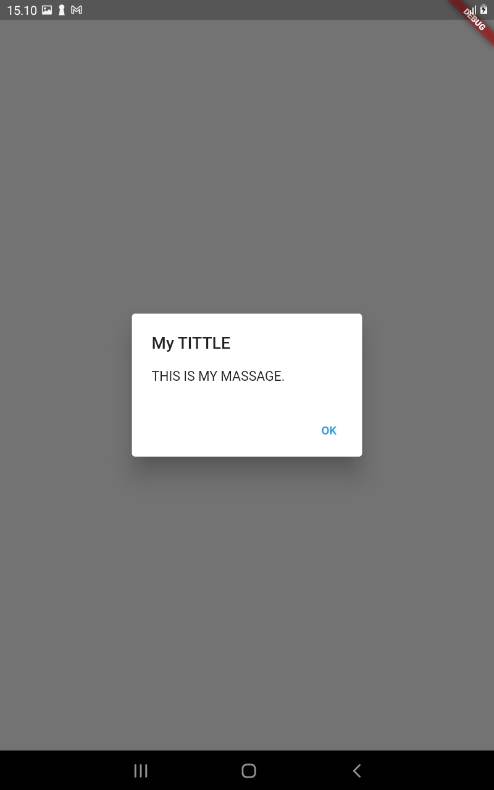

## Langkah 5: Input dan Selection Widget

## Hasil di Emulator

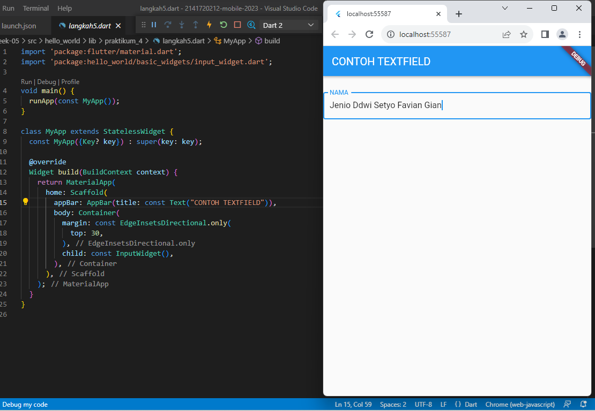

## Hasil di HP (SAMSUNG)

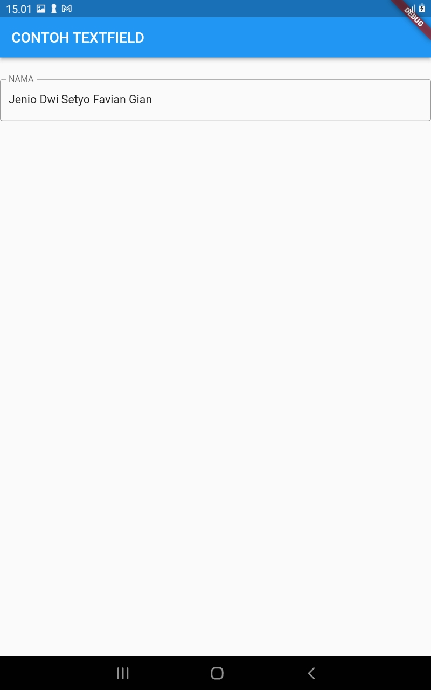

## Langkah 6: Date and Time Pickers

## Hasil di Emulator

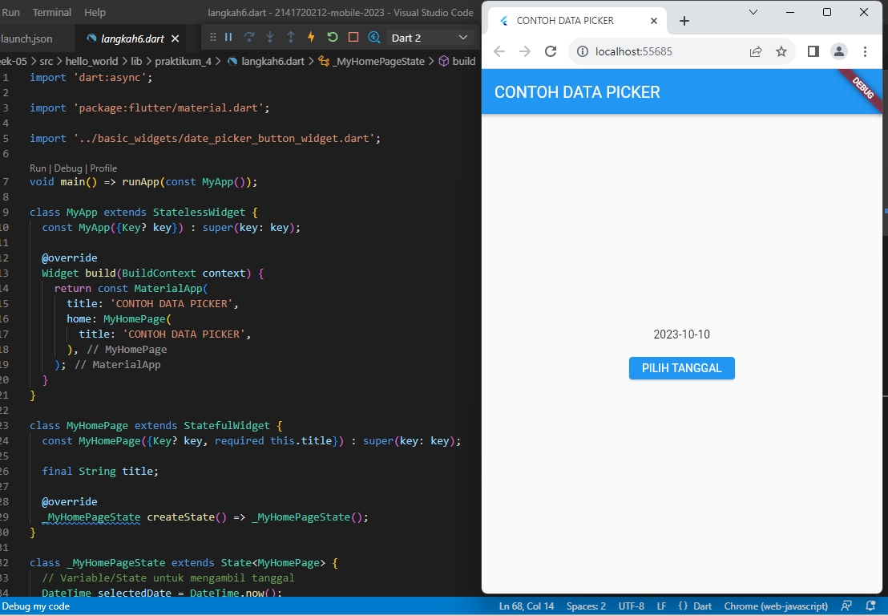

## Hasil di HP (SAMSUNG)

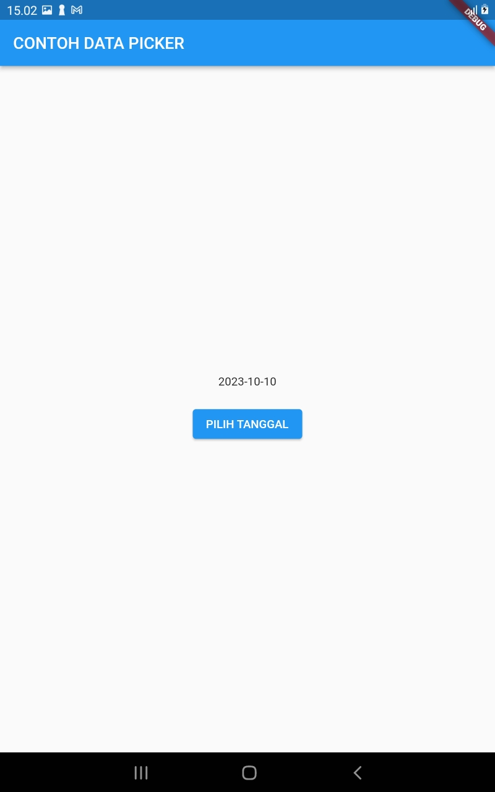

---

# Your first Flutter app

## Hasil di Emulator

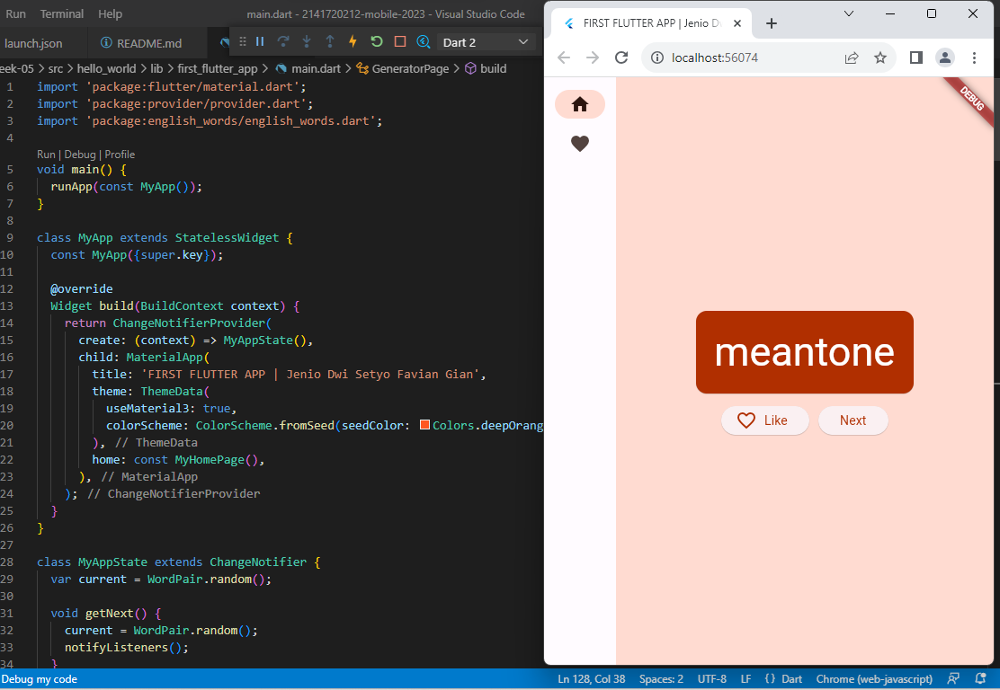

## Hasil di HP (SAMSUNG)

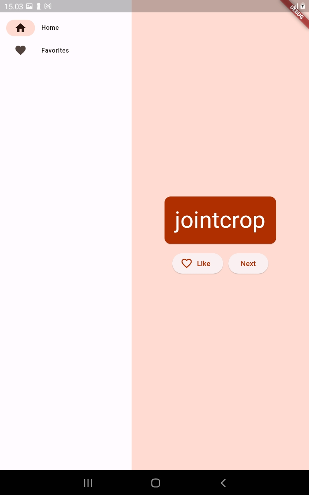