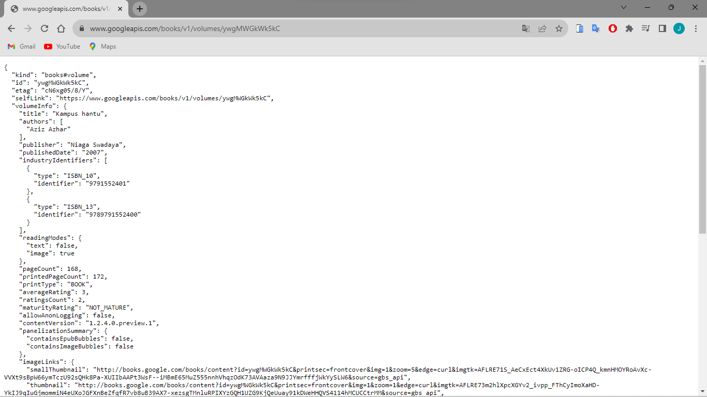

# Jenio Dwi Setyo Favian Gian (2141720212) / 3F

---

## Hasil Praktikum1 Soal 2

---
## Hasil Praktikum1 Soal 3

`substring` dan `catchError`!
1. substring : Metode substring digunakan pada objek String untuk mengambil potongan dari string tersebut. `substring(0, 450)` digunakan untuk mengambil karakter dari indeks 0 hingga indeks 449 dari string tersebut atau hanya mengambil 450 karakter dari respon HTTP yang didapatkan. 
2. catchError : Metode `catchError` digunakan dalam konteks Future (keluaran dari fungsi `getData()`). Jika Future menghasilkan error, maka blok kode dalam `catchError` akan dijalankan. Dalam hal ini, jika terjadi kesalahan selama pemanggilan `getData()`, blok kode `result = 'An error occurred'; setState(() {});` akan dieksekusi. Ini akan menetapkan string "An error occurred" ke variabel `result` dan kemudian memicu pembaruan ke tampilan melalui `setState`.

---

## Hasil Praktikum1 Soal 3

