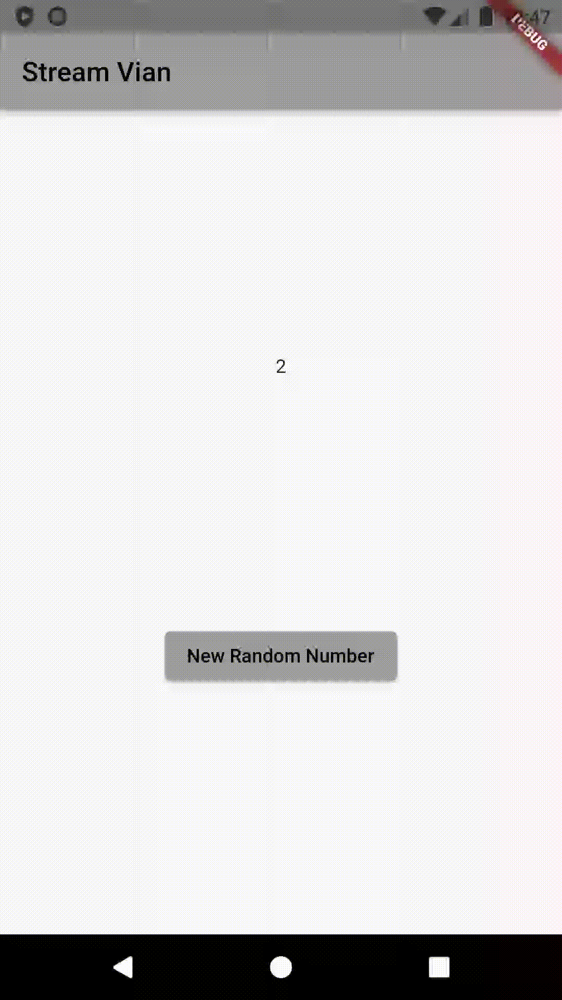
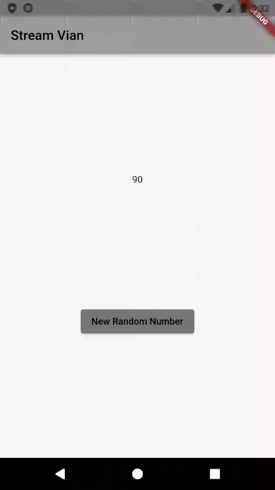

# Jenio Dwi Setyo Favian Gian (2141720212) / 3F

---

## Hasil Praktikum_1

---

## Penjelasan Soal 5 Langkah 9

list digunakan untuk menyimpan dan memanipulasi data secara sinkron, sementara await for digunakan dalam asyncio untuk iterasi asinkron melalui objek iterable dalam fungsi asinkron, memungkinkan penanganan operasi yang memerlukan waktu.

---

## Hasil Praktikum_2

---

Langkah8 : untuk menginisialisasi stream controller dan sink-nya. stream kemudian diambil dari controller dengan menggunakan numberStreamController.stream. Kemudian, listen digunakan pada stream untuk mendengarkan perubahan yang terjadi pada Stream. Ketika ada perubahan (saat angka baru ditambahkan ke dalam Stream), fungsi yang diberikan akan dipanggil. Di sini, nilai yang diterima dari Stream akan diperbarui dalam state dengan menggunakan setState, dan nilai terakhir lastNumber akan diperbarui dengan nilai dari Stream.

Langkah10 : addRandomNumber() method yang bertujuan untuk menambahkan angka acak ke dalam Stream. Pertama, sebuah objek dari kelas Random diciptakan untuk menghasilkan angka acak. Kemudian, angka acak di-generate menggunakan nextInt(10) untuk mendapatkan angka random dari 0 hingga 9. Terakhir, angka tersebut ditambahkan ke dalam Sink yang ada di numberStream melalui method addNumberToSink().

---

## Penjelasan Soal 7 Langkah 13-15
Soal 13 : digunakan untuk mengirimkan pesan error (dalam hal ini, pesan 'error') ke dalam sink dari suatu Stream, sehingga Stream akan menghasilkan error tersebut. Ini berguna untuk memberi tahu penerima Stream bahwa terjadi kesalahan atau kondisi yang tidak diharapkan dalam aliran data.

Soal 14 : onError() adalah bagian dari penanganan kesalahan pada Stream, dipanggil ketika error terjadi dalam aliran data. Dalam contoh tersebut, ketika error terdeteksi, fungsi yang disediakan akan dijalankan, menggunakan setState() untuk memperbarui nilai terakhir lastNumber dengan nilai -1, memberikan penanda bahwa terdapat kesalahan dalam aliran data yang dikirimkan melalui Stream.

Soal 15 : digunakan untuk menambahkan sebuah error ke dalam Stream. Dalam konteks ini, ketika metode ini dipanggil, ia akan mengirimkan pesan error ke dalam sink yang terkait dengan Stream, memicu operasi .onError() yang telah ditentukan sebelumnya. Ini memungkinkan kode yang menangani error (seperti dalam .onError()) untuk dijalankan, memberikan kesempatan untuk menangani kondisi error yang muncul dalam aliran data Stream.

---

## Hasil Praktikum_3

---

## Penjelasan Soal 8 Langkah 1-3
Langkah 1 : deklarasi variabel yang akan digunakan sebagai objek StreamTransformer. Penggunaan kata kunci late memungkinkan kita untuk menunda inisialisasi variabel hingga saat yang tepat sebelum penggunaannya dalam program.

Langkah 2 : memberikan nilai pada variabel transformer, yaitu sebuah objek StreamTransformer yang akan mengubah data yang melewati stream. Melalui metode fromHandlers(), kita menentukan cara menangani data yang diterima dari stream tersebut. Dalam kasus ini, kita mendefinisikan perilaku ketika ada data yang masuk, ketika terjadi kesalahan, dan ketika stream selesai.

Langkah 3 : menerapkan transformer yang sebelumnya ke dalam stream menggunakan metode transform(). Transformer ini akan mengubah data yang mengalir melalui stream sebelumnya. Kemudian, dengan menggunakan listen(), kita mulai mendengarkan (listen) stream yang sudah diubah. Di dalamnya, kita menentukan bagaimana aplikasi harus menangani data yang masuk ke dalam stream tersebut, serta bagaimana menangani kesalahan yang mungkin muncul selama proses tersebut.

---

## Hasil Praktikum_4

---

## Penjelasan Soal 9 Langkah 2,6, dan 8
Langkah 2 : membuat sebuah objek NumberStream, kemudian mengakses controller dari objek tersebut untuk mengontrol stream yang dihasilkan. Selanjutnya, mendapatkan stream dari numberStreamController yang merupakan aliran data yang dapat didengarkan. Kemudian, menggunakan metode listen() pada stream untuk mulai mendengarkan nilai-nilai yang masuk ke dalam stream tersebut. Ketika ada data baru yang masuk, setState() digunakan untuk memperbarui nilai lastNumber dengan nilai terbaru dari stream.

Langkah 6 : numberStreamController.close() digunakan untuk menutup controller stream, menghentikan pengiriman data ke dalam stream. Selanjutnya, subscription.cancel() digunakan untuk membatalkan langganan (subscription) terhadap stream yang telah dibuat sebelumnya. Hal ini penting untuk memastikan bahwa tidak ada langganan yang tersisa yang dapat menyebabkan memory leak atau masalah sumber daya lainnya setelah widget atau halaman dihapus.

Langkah 8 : addRandomNumber() digunakan untuk menambahkan nomor acak ke dalam stream menggunakan objek Random untuk mendapatkan nomor acak antara 0 hingga 9. Selanjutnya, memeriksa apakah numberStreamController sudah ditutup (isClosed). Jika controller stream masih terbuka, maka menggunakan numberStream.addNumberToSink(myNum) untuk menambahkan nomor acak ke dalam stream. Namun, jika controller stream sudah tertutup, maka setState() digunakan untuk mengubah nilai lastNumber menjadi -1, yang menunjukkan bahwa ada masalah dalam menambahkan nomor ke dalam stream yang sudah ditutup.

---

## Hasil Praktikum_5

---

## Penjelasan Soal 10 dan 11
Soal 10 : StateError (Bad state: Stream has already been listened to.) karena mencoba untuk mendengarkan (listen) stream yang sama lebih dari sekali secara bersamaan. stream seharusnya unik, jadi ketika dijalankan bersamaan akan terjadi konflik.

Soal 11 : karena menggunakan Stream stream = numberStreamController.stream.asBroadcastStream(); sehingga dapat didengarkan oleh beberapa subscriptions secara bersamaan, berbeda dengan stream biasa yang hanya dapat didengarkan sekali. dan setiap subscritions akan menerima data yang sama pada waktu yang bersamaan.

---

## Hasil Praktikum_6

---

## Penjelasan Soal 12 Langkah 3 dan 7
Langkah 3 : kode tersebut mendefinisikan class (NumberStream()) yang memiliki metode (getNumbers()) untuk mengembalikan stream berisi angka acak dengan periode waktu selama 1 detik.

Langkah 7 : kode tersebut digunakan untuk membuat tampilan UI untuk menampilkan nilai dari stream secara real-time. Dengan menggunakan (StreamBuilder), antarmuka akan diperbarui secara otomatis setiap kali ada perubahan stream, baik itu perubahan value atau ketika terdapat error. Terdapat kondisi ketika terjadi error maka akan menampilkan pesan 'Error!', ketika tidak terjadi error dan mendapatkan data dari stream maka akan menampilkan angka acak dengan gaya fontSize diatur sebesar 96, namun apabila tidak ada data yang diterima maka akan menampilkan widget kosong.